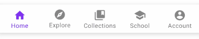
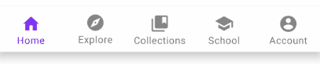
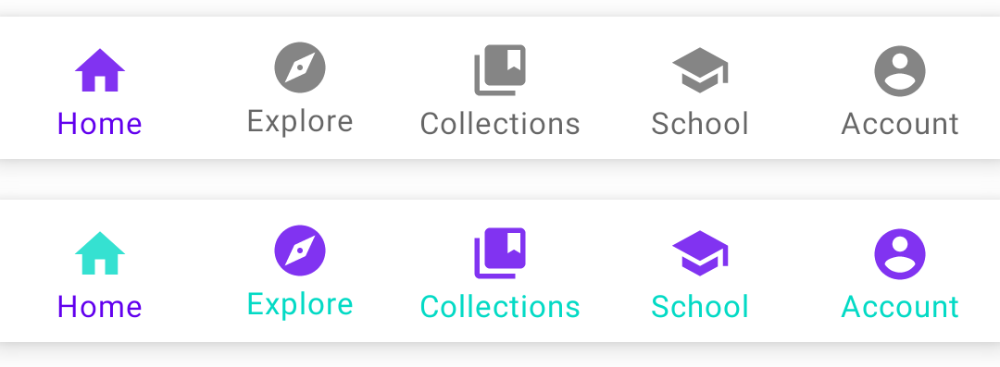
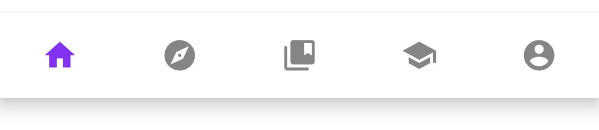
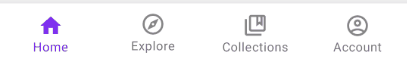
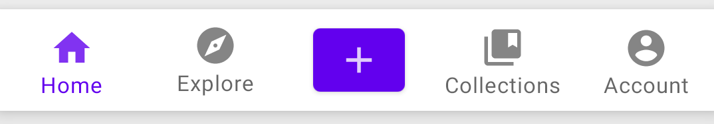
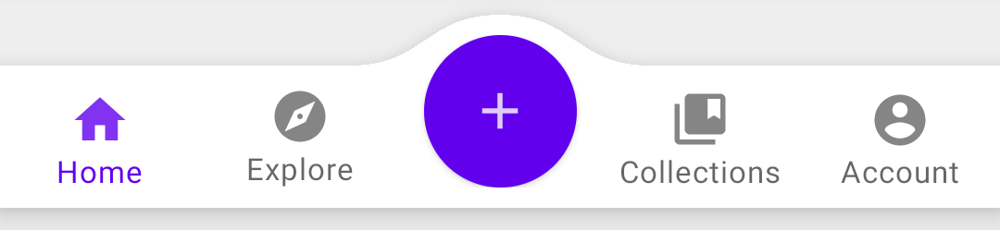
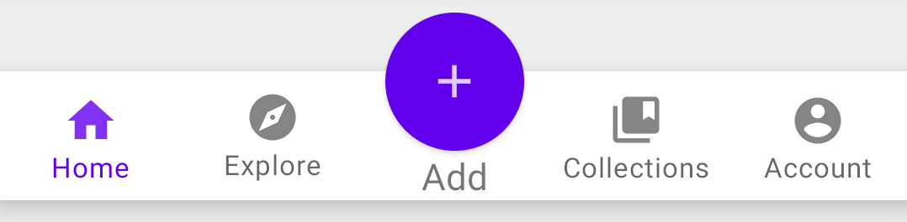
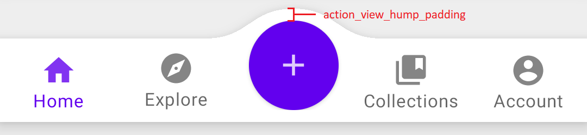

[](./README.zh.md)

# BottomNavigationBar


The bottom navigation widget based on the [menu](https://developer.android.com/guide/topics/ui/menus). Instant preview, WYSIWYG.
<p align="center">
    
</p>

**Note**: The widget doesn't support shift mode, use the [BottomNavigationView](https://material.io/components/bottom-navigation/android) from Google instead if need. The [BottomNavigationView](https://material.io/components/bottom-navigation/android) is also recommended if you just need a simple bottom navigation bar and no other features are required. In addition, all features of the widget have not yet been completed, such as the badge. So the current version is not the final stable version, and the pull requests are currently not accepted. More features will be released in subsequent versions.

## Quick Start
### Add dependency
```groovy
dependencies {
    implementation 'io.github.vejei.bottomnavigationbar:bottomnavigationbar:x.y.z'
}
```

### Set up
Add `BottomNavigationBar` to your layout, and specify the `navigation_menu` attribute:
```xml
<io.github.vejei.bottomnavigationbar.BottomNavigationBar
    android:id="@+id/bar_five_items"
    android:layout_width="match_parent"
    android:layout_height="wrap_content"
    app:navigation_menu="@menu/bottom_nav_five_items" />
```

Menu resource sample:
```xml
<?xml version="1.0" encoding="utf-8"?>
<menu xmlns:android="http://schemas.android.com/apk/res/android">
    <item android:id="@+id/home" android:title="@string/menu_home" android:icon="@drawable/ic_home_filled"/>
    <item android:id="@+id/explore" android:title="@string/menu_explore" android:icon="@drawable/ic_explore_filled"/>
    <item android:id="@+id/collections" android:title="@string/menu_collections" android:icon="@drawable/ic_collections_filled"/>
    <item android:id="@+id/school" android:title="@string/menu_school" android:icon="@drawable/ic_school_filled"/>
    <item android:id="@+id/account" android:title="@string/menu_account" android:icon="@drawable/ic_account_filled"/>
</menu>
```

## Tutorial
### Set up item background
The item background is specified by the `item_background` attribute, if not specified, the `item_ripple_color` will be used as the background. If neither is specified, the default value is used. `item_ripple_color` can be a color value directly or [ColorStateList](https://developer.android.com/reference/android/content/res/ColorStateList). If item background is specified by `item_ripple_color`, `item_ripple_enabled` used to enabled or disable ripple background. `item_unbounded_ripple` specify the ripple background unbounded or bounded, `true` is unbounded, `false` is bounded, default value is true.

`item_unbounded_ripple=true`：
<p align="center">
    
</p>

`item_unbounded_ripple=false`：
<p align="center">
    
</p>

`item_ripple_enabled=false`：
<p align="center">
    
</p>

Check [item_ripple_samples.xml](samples/src/main/res/layout/item_ripple_samples.xml) for sample code.

### Set up item label and icon color
The label and icon colors are specified by `item_label_text_color` and `item_icon_tint` respectively. Note, the `android:textColor` in `item_label_text_appearance_inactive` and `item_label_text_appearance_active` will be ignore, so always use the `item_label_text_color` to specify label text color.

<p align="center">
    
</p>

Check [item_color_samples.xml](samples/src/main/res/layout/item_color_samples.xml) for sample code.

### Set up text appearacne for item label
`item_label_text_appearance_inactive` for unselected item's label text appearance, and `item_label_text_appearance_active` for selected item's label text appearance.

Check [label_text_appearance_samples.xml](samples/src/main/res/layout/label_text_appearance_samples.xml) for sample code.

### Change item label visibility mode
The `item_label_visibility_mode` determines the visibility of item label, only support `always` and `never` mode currently. In `always` mode, label always visible, and only icon in `never` mode.

<p align="center">
    
</p>
<p align="center">
    
</p>

### Change icon on item status change
Create a [StateListDrawable](https://developer.android.com/guide/topics/resources/drawable-resource#StateList)：
```xml
<?xml version="1.0" encoding="utf-8"?>
<selector xmlns:android="http://schemas.android.com/apk/res/android">
    <item android:state_checked="true" android:drawable="@drawable/ic_home_filled"/>
    <item android:drawable="@drawable/ic_home_outlined"/>
</selector>
```
In your menu resource (specified by `navigation_menu`), use the icon with the `.xml` suffix instead of the original `.png` suffix.

<p align="center">
    
</p>

Check [bottom_nav_change_icon.xml](samples/src/main/res/menu) and [change_icon_sample.xml](samples/src/main/res/layout/change_icon_sample.xml) for sample code.

### Add action view
Using `action_layout` to specify your action layout, and `action_view_attach_mode` specify the attach mode, which is used to determine how the action view attaches to the bar.

| Attach mode | Result |
| ------------- |:-------------:|
| `embed` |  |
| `hump` |  |
| `overlap` |  |

`action_view_hump_padding` specify the padding between hump and action view：
<p align="center">
    
</p>

Check [ActionViewSamplesFragment](samples/src/main/java/io/github/vejei/bottomnavigationbar/samples) and [fragment_action_view_samples.xml](samples/src/main/res/layout/fragment_action_view_samples.xml) for sample code.

### Work with fragments
Check [SetupFragmentSamplesFragment](samples/src/main/java/io/github/vejei/bottomnavigationbar/samples/) for sample code.

## License
Distributed under the MIT License. See [LICENSE](./LICENSE) for more information.
