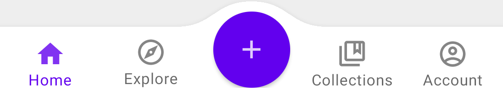
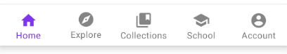
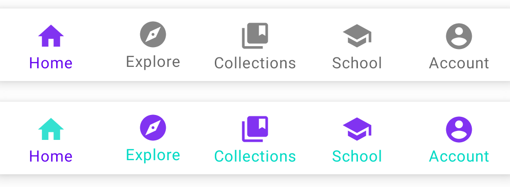
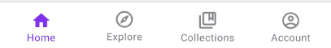
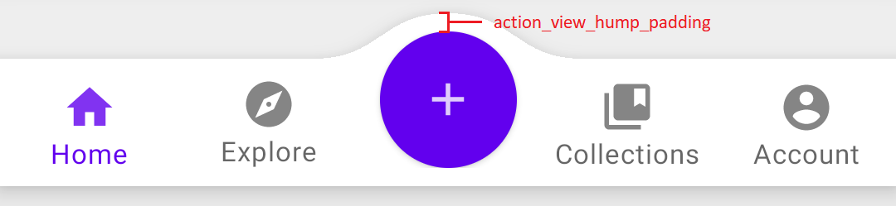

[](./README.md)

# BottomNavigationBar


基于[菜单](https://developer.android.com/guide/topics/ui/menus)实现的底部导航栏控件。可即时预览，所见即所得。
<p align="center">
    
</p>

**特别说明**：控件不支持 *shift mode*，如果需要的话，请使用官方的 [BottomNavigationView](https://material.io/components/bottom-navigation/android) 。如果只是需要实现简单的底部导航没有特殊需求，也推荐使用 [BottomNavigationView](https://material.io/components/bottom-navigation/android)。另外，项目所有特性还没有编写完成，例如角标就还没有实现，所以当前的版本并不是最终稳定版，暂时不接受`Pull Request`，更多特性会跟随后续的版本发布。

## 快速开始
### 添加依赖
```groovy
dependencies {
    implementation 'io.github.vejei.bottomnavigationbar:bottomnavigationbar:x.y.z'
}
```

### 设置
在布局中添加`BottomNavigationBar`，并设置`navigation_menu`属性，让它引用用于导航项的菜单文件：
```xml
<io.github.vejei.bottomnavigationbar.BottomNavigationBar
    android:id="@+id/bar_five_items"
    android:layout_width="match_parent"
    android:layout_height="wrap_content"
    app:navigation_menu="@menu/bottom_nav_five_items" />
```

菜单文件示例：
```xml
<?xml version="1.0" encoding="utf-8"?>
<menu xmlns:android="http://schemas.android.com/apk/res/android">
    <item android:id="@+id/home" android:title="@string/menu_home" android:icon="@drawable/ic_home_filled"/>
    <item android:id="@+id/explore" android:title="@string/menu_explore" android:icon="@drawable/ic_explore_filled"/>
    <item android:id="@+id/collections" android:title="@string/menu_collections" android:icon="@drawable/ic_collections_filled"/>
    <item android:id="@+id/school" android:title="@string/menu_school" android:icon="@drawable/ic_school_filled"/>
    <item android:id="@+id/account" android:title="@string/menu_account" android:icon="@drawable/ic_account_filled"/>
</menu>
```

## 使用指北
### 设置导航项背景
导航项背景使用`item_background`属性指定，如果没有指定则使用`item_ripple_color`作为背景，两个都没有指定则使用默认值。`item_ripple_color`可以是单个的颜色值，也可以是 [ColorStateList](https://developer.android.com/reference/android/content/res/ColorStateList) 。当背景是`item_ripple_color`指定的颜色时，`item_ripple_enabled`用于指定是否启用背景。`item_unbounded_ripple`用于指定背景的边框样式，`true`表示是圆形，`false`表示不使用圆形，即矩形边框的背景。

`item_unbounded_ripple=true`：
<p align="center">
    
</p>

`item_unbounded_ripple=false`：
<p align="center">
    
</p>

`item_ripple_enabled=false`：
<p align="center">
    
</p>

示例代码见 [item_ripple_samples.xml](samples/src/main/res/layout/item_ripple_samples.xml)

### 设置导航项文本和图标颜色
文本和图标颜色颜色分别通过`item_label_text_color`和`item_icon_tint`指定。需要注意的地方是，`item_label_text_appearance_inactive`和`item_label_text_appearance_active`指定的颜色会被忽略，所以不要通过这两个属性来指定文本颜色。

<p align="center">
    
</p>

示例代码见 [item_color_samples.xml](samples/src/main/res/layout/item_color_samples.xml)

### 设置导航项文本样式
文本样式通过`item_label_text_appearance_inactive`和`item_label_text_appearance_active`指定，前一个指定的是导航项未选中状态下使用的文本样式，后一个指定的是选中状态下的文本样式。

示例代码见 [label_text_appearance_samples.xml](samples/src/main/res/layout/label_text_appearance_samples.xml)

### 设置导航项文本可见模式
`item_label_visibility_mode`属性控件导航项文本是否可见，当前只支持`always`和`never`两种模式。`always`表示文本总是可见，`never`表示文本不可见，即只显示图标。

<p align="center">
    
</p>
<p align="center">
    
</p>

### 不同状态下使用不同图标
要让导航项选中和未选中状态使用不同的图标，需要使用对应的图标来创建 [StateListDrawable](https://developer.android.com/guide/topics/resources/drawable-resource#StateList)，例如：
```xml
<?xml version="1.0" encoding="utf-8"?>
<selector xmlns:android="http://schemas.android.com/apk/res/android">
    <item android:state_checked="true" android:drawable="@drawable/ic_home_filled"/>
    <item android:drawable="@drawable/ic_home_outlined"/>
</selector>
```
然后菜单（`navigation_menu`属性指定的）项的`icon`属性需要引用`StateListDrawable`，即`.xml`后缀的而不是原来`.png`后缀的图标。

<p align="center">
    
</p>

示例代码见 [bottom_nav_change_icon.xml](samples/src/main/res/menu) 和 [change_icon_sample.xml](samples/src/main/res/layout/change_icon_sample.xml)

### 添加中间操作布局
中间操作布局通过`action_layout`属性指定。`action_view_attach_mode`属性指定布局的放置方式，`embed`表示内嵌，`hump`表示隆起，`overlap`表示覆盖。三种模式分别如图所示：

<p align="center">
    
</p>
<p align="center">
    
</p>
<p align="center">
    
</p>

`action_view_hump_padding`指定隆起形状和中间布局之间的边距：
<p align="center">
    
</p>

示例代码见 [ActionViewSamplesFragment](samples/src/main/java/io/github/vejei/bottomnavigationbar/samples) 和 [fragment_action_view_samples.xml](samples/src/main/res/layout/fragment_action_view_samples.xml)

### 设置`Fragment`
见 [SetupFragmentSamplesFragment](samples/src/main/java/io/github/vejei/bottomnavigationbar/samples/)

## 开源许可
根据 MIT 许可开源，详见 [LICENSE](./LICENSE)。
